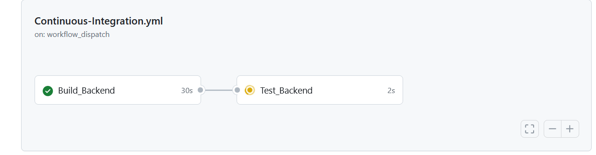

# FinToUp

## Who I m
Hi, I'm Tomasz, and I'm a .NET Developer. However, I feel like I've been stuck in the older .NET Framework stack, so I'm want to learn new things like .NET Core 8.0 and React 18. Additionally, I'm interested in expanding my knowledge in DevOps CI/CD, including Docker, pipelines, and more.

# What is the FinToUp Project?
FinToUp is primarily a financial management project that allows users to manage their monthly income and expenditures on a month-by-month basis.
Secondly, it represents a new journey for me to create something innovative upon completing all other projects. It's an opportunity to work with new technologies and expand my skill set.
Most importantly, the project is for me. While it may become publicly visible, I primarily want a personal tool that I will use daily. This endeavor will also provide an opportunity to learn and grow within new technologies.

# Technology in the Project
## Backend
The backend will be a REST API implemented in .NET Core 8.0 in the CQRS pattern.

## Database
The database will likely be Microsoft SQL Server, employing the Code First approach in the Entity Framework.

## Testing 
I will try to create code by TDD, a approach method.

## DevOPS
Go Try CI action by Actual Sprint-2 branch

https://github.com/Yigrashill/FinToUp/tree/Sprints/Sprint-2

https://github.com/Yigrashill/FinToUp/actions/workflows/Continuous-Integration.yml

## CI proces is building and testing Backend aplication using Pipline

## The frontend
It will be rendered using React 18 with Axios for HTTP requests.
I will explore the possibility of using Flutter for CSS classes and incorporating some pre-built components.
If it will posible in this scope i will try Use Next.js

# Planing 🔁
To have a plan for this application, I've set up a project in Notion and integrated it with GitHub. Whenever I make a pull request to the main or sprint branch with a tag number in the pull request name, I will close the task in Notion. Planning is divided into two-weekly sprints, and depending on my availability to delivercode, I'll aim to complete roughly one task per day to maintain the pace of 100 tasks in :100: days and have steady daily progress. Beffore I start each sprint I will prepare a list tasks in backlog with inteniton to delivering them witch time frame i panned. Of Corse, everything is in Notion :)
The first sprint is described below. 

### Working Hours 🕓
I work on a daily basis :) so I don't have much time to write applications.
However, I've set aside about 30 minutes in the morning before going to work.

### 🔵 Sprint 2  (March 18, 2024 → March 31, 2024)

Status | Name
:---:| ---
✅| TASK-72 Edit CI proces to not create artifacts in proces.
✅| TASK-76 Create Mock of IFinanceRepository.
✅| TASK-74 Get All Finances Query Handler Test.
✅| TASK-87 Create Finance Query Handler Test.
✅| TASK-75 Create Test for Create Finance Command Handler.
✅| TASK-78 Create Test for Update Finance Command Handler.
✅| TASK-79 Create Test for Deleate Finance Command Handler.
✅| TASK-80 Add Logger
✅| TASK-82 Create REST API FinanceController
✅| TASK-83 Http GetAll From API Controller
✅| TASK-84 Create FinanceController Integration Test
☑️| TASK-85 Implement Create Method in FinanceController
☑️| TASK-86 Test Create Method in FinanceController
✅| TASK-89 Implement Update Method in FinanceController
✅|  TASK-90 Test Update Method in FinanceController
⬜| TASK-91 Implement Delete Method in FinanceController
⬜| TASK-92 Test Delete Method in FinanceController
⬜| TASK-93 Write Some base documentation, what you alredy build in March

### 🔵 Sprint 1  (March 1, 2024 → March 17, 2024)

Status | Name
:---:| ---
✅| Generic and Base Contract repositories in application project.
✅| Create new Empty project solution.
✅| Integrate Notion with GitHub to create backlog for task
✅| Create Generic repositories.
✅| Add Automaper and MediatR.
✅| Update Read Me - add to Read me file Sprint 1 backlog.
✅| Create CQRS Request and Handler.
✅| Custom Exceptions
✅| Fluent Validation 
✅| Add Entity Framework and Database Context
✅| Create Repositories.
✅| Add .NET build action in GitHub
✅| Add Testing Project
✅| Add testing Action in GitHub

 ### ⚪ Backlog

Status | Name
:---:| ---
⬜️| TASK- Develop REST Client tests for the Create new finance.
⬜️| TASK- Develop REST Client tests for the Update finance.
⬜️| TASK- Develop REST Client tests for the Delete finance.
⬜️| TASK- Add Entity Framework Code first Data Base
☑️| Icon Helper
